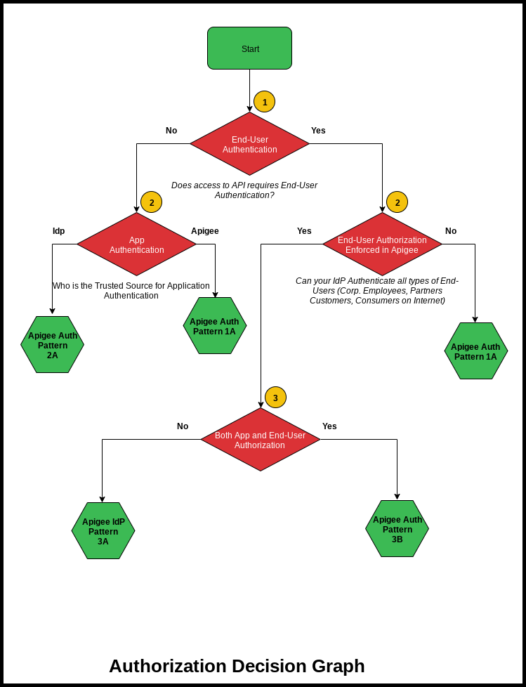

# Apigee and Identity & Access Management (I&AM) integration

## Overview
In addition to simple access which is a binary operation it is sometimes necessary to allow a more fine grained access control to APIs and their subsequent operations. We can accomplish this through the use of scopes.

## Common Authorization Use Cases

Based on requirements across enterprise customers, here is a list of 7 most commonly used Apigee and I&AM integration design patterns.

Below decision graph helps you pick the right design pattern that addresses your enterprise needs.
The leaf nodes of this graph are the 7 design patterns, based on your key decisions you make at each decision node you land upon a specific design pattern that best fits your needs. 

The design pattern refers to a high level reference architecture, a well-defined solution architecture and fully deployable Apigee solution.

## Glossary / Terminology
**IdP** :Identity Provider, the solution that is responsible for providing Identity services such as Authentication, Authorization and SSO.

**end-user**: end-user refers to the actor that accesses the APIs at runtime from his/her mobile device, web applications etc.

**App**: App refers to the Application from which the APIs are invoked at runtime.

**API Token Authority**: Refers to the component that provides API Access Tokens. These API Access Token can be used for Identification, Authentication and in some cases Authorization.

## Decision Graph
Here is the graph that helps you pick the design pattern that fulfills your enterprise security requirements.

Here are detailed of key decision you make in the above decision graph:

**Decision 1: End-User Authentication** 

For the simplest use cases it’s suffiicient to show simple Oauth flows where apigee access as the IdP. In this case its about simple application identification which really is identifying the developer and not the end user.

**Decision 2: End-User Authorization Enforced in Apigee** 
A more in-depth and complicated use cases concerns the application of 
End-User Authorization. Sometimes Apigee will simply ignore the authorization information for the End-User and pass it on to the backend and other times Apigee itself will act as an enforcement point for that End-User Authorization Information.

**Decision 3: Both App and End-User Authorization**
For some use cases the End-User Authorization is extremely important and we need a strategy for handling these use cases in Apigee.

NOTE: Apigee should never perform End-User Authorization, so for the purposes of these labs we've assumed that if Apigee does indeed n

## Solutions Architecture

Each green hexagon represents a design pattern that is derived based on above decisions. Below links to these design patterns show its reference and solution architecture.

[Apigee Auth Pattern 1A](./Auth-Pattern-1A)

Apigee Auth Pattern 2A (coming soon..)

Apigee Auth Pattern 2B (coming soon..)

Apigee Auth Pattern 3A (coming soon..)

Apigee Auth Pattern 3B (coming soon..)
